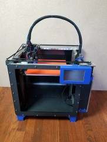
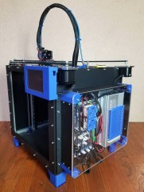
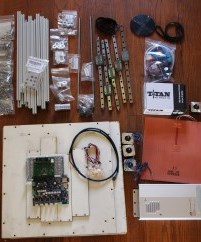

RailCore II is a [Core-XY based Reprap 3D printer](https://reprap.org/wiki/CoreXY) designed by J. Steve White & Tony Akens under the [CC-Attribution Only license](https://creativecommons.org/licenses/by/3.0/).

| Front                                                                                                 | Side                                                                                                | Parts                                                                               | Prints                                                                   |
|-------------------------------------------------------------------------------------------------------|-----------------------------------------------------------------------------------------------------|-------------------------------------------------------------------------------------|--------------------------------------------------------------------------|
|  |  |  |  |

## Official Assembly Guide, BOM, Model and Printable Parts 

The Fusion360 models, Assembly Guide and BOM are the official, master copies maintained by Tony Akens. Thingiverse project is also maintained by Tony Akens.

 * [RailCore II 300ZL/ZLT Assembly Guide](https://railcore.page.link/guide)
 * [RailCore II 300ZL/ZLT Thingiverse Project(all printable parts)](https://www.thingiverse.com/thing:2407174)
 * **Bill Of Materials**
   * [RailCore II 300ZL Bill Of Materials](https://railcore.page.link/zlbom)
   * [RailCore II 300ZLT Bill Of Materials](https://railcore.page.link/zltbom)
 * **Fusion 360 Models**
   * [RailCore II 300ZL Fusion360 Model](https://railcore.page.link/zlmodel)
   * [RailCore II 300ZLT Fusion360 Model](https://railcore.page.link/zltmodel)
 * [Be a patron or donate to the project](https://www.kraegar.com/railcoreii) - *Donations and subscriptions go towards the development of new improvements for the RailCore II.*

## RailCore II Community Resources

Please read these resources carefully to answer many common questions, and contribute information where you can add!

See our [Contributing page](/CONTRIBUTING.md) for more information on contributing to these guides.

* [Build & Troubleshoot](/build_and_troubleshoot) - how to assemble and get your RailCore II running.
* [Hardware](/hardware) - all about choosing and sourcing the parts for your RailCore II.
* [Software](/software) - how to configure the firmware on your RailCore II as well as your slicer.
* [Customization](/customization) - information of variations and customization of the RailCore II.

### Discussion
   * [Facebook Group](https://www.facebook.com/groups/RailCore/)
   * [Reddit sub](https://www.reddit.com/r/railcore/) *new*
   * [Forum](https://forum.railcore.org/)
   
### Chat

   * [Discord Channel](https://discord.gg/Sy569Hq)
   * [#RailCore IRC channel on freenode](https://tinyurl.com/yxl725zs) - *you must be authenticated with Freenode to enter the channel*

## More about the RailCore II

The initial idea to collaborate on a printer started in the #RepRap IRC channel, and centered on some common goals we both had in mind for a new printer design.

These were:
 * Core-XY motion.
 * All Linear rails for movement.
 * Space & cost-efficient, enclosable frame.
 * Key components being printable, or able to be milled.
 * Flexibility and scalability in the design.
 * A professional looking printer.
 * Self sourced and easily customizable.

J. Steve White had previously built the Railcore - the alpha version of this printer.  Lessons were learned and the design on the new printer began.  All design work was done in Fusion360.
As it progressed, we decided to publish this printer in an open, documented format for others to build as well. [For the curious, there is a more detailed version of the story of how the RailCore II came to be.](/the_railcore_story.md)

The frame is designed to be 1515 aluminum extrusion.  This was a space efficient choice, which makes building the printer easier, as standard M3 hardware works like a T-Nut fitting into the extrusion nicely.  To add rigidity, we use HDPE sides to stiffen the frame.  (These can be cut out of any material you prefer, including melamine, plywood, acrylic & aluminum).  The total cost for the actual frame components (extrusion, corner cubes, and sides) is roughly $100.

Some notable aspects of the design: 3 trapezoidal lead screws Z-axis, stacked idlers and duo-planar belt path.
The electronics in the design are the Duet (Wifi or Ethernet), Duex2/5,  24v PSU and 0.9 degree steppers.  We used an E3D v6 for the design, as it's the most common hotend at this time.  Support for other hotends such as Bondtech and Mosquito and many others are also available.
Semi-Direct drive or full bowden is supported.
[More questions? Have a look at the General FAQ](/faq.md)

*A special thanks to [Filastruder](https://www.filastruder.com/), [Duet3d](https://www.duet3d.com/), [E3D](https://e3d-online.com/), [SeeMeCNC](https://www.seemecnc.com/), [Mandala Rose Works](http://www.mandalaroseworks.com/product/railcore), [713 Maker](https://713maker.com/railcore) and [Project R3D](https://www.projectr3d.com/) for supporting the project.*

## Table of RailCore II ZL Versions

|                   | RailCore II ZL                                                                                              | RailCore II 300ZL                                                                                                                                                                                                        | RailCore II 300ZLT                                                                                                                                                                                                       |
|-------------------|-------------------------------------------------------------------------------------------------------------|--------------------------------------------------------------------------------------------------------------------------------------------------------------------------------------------------------------------------|--------------------------------------------------------------------------------------------------------------------------------------------------------------------------------------------------------------------------|
| X/Y Printable     | 250×250                                                                                                     | 300×300                                                                                                                                                                                                                  | 300×300                                                                                                                                                                                                                  |
| Z Printable       | 280                                                                                                         | 330                                                                                                                                                                                                                      | 600                                                                                                                                                                                                                      |
| Auto Leveling?    | Yes                                                                                                         | Yes                                                                                                                                                                                                                      | Yes                                                                                                                                                                                                                      |
| Fusion 360 Model  | [Model](http://a360.co/2DoeHFu)                                                                             | [Model](http://a360.co/2D5OryV)                                                                                                                                                                                          | [Model](https://a360.co/2w7PjT6)                                                                                                                                                                                         |
| Bill of Materials | [BOM](https://docs.google.com/spreadsheets/d/1QZgV6a6Gk4xR9WxrK2C4QYaPQTXA8t7dFDyHO74-oSY/edit?usp=sharing) | [BOM](https://docs.google.com/spreadsheets/d/1Eib0IkmRiP-zVM2p6gZ9PJ2bsDDvSKWbGtUybuFWfcs/edit?usp=sharing)                                                                                                              | [BOM](https://docs.google.com/spreadsheets/d/1L8mOABLsbfHb1PVPEnT-TpgfRpO25UduGNxD8GNMPSs/edit?usp=sharing)                                                                                                              |
| Assembly Guide    | [Guide](https://docs.google.com/document/d/1OoXfw7aXMz0NzAxkdwuChC0FpunLRyKI02_1vJF52hk/edit?usp=sharing)   | [Guide](https://docs.google.com/document/d/19FuTYfwqgOkGO8SUScnSuhS_Gx8mJMmXLiPgBfGeJ-s/edit?usp=sharing) [Kit wiring](https://docs.google.com/document/d/1aIc6x7Vzb-bH8-pILNBV1cXyp3JWsIa50Y6eSjMmCgM/edit?usp=sharing) | [Guide](https://docs.google.com/document/d/19FuTYfwqgOkGO8SUScnSuhS_Gx8mJMmXLiPgBfGeJ-s/edit?usp=sharing) [Kit wiring](https://docs.google.com/document/d/1aIc6x7Vzb-bH8-pILNBV1cXyp3JWsIa50Y6eSjMmCgM/edit?usp=sharing) |
