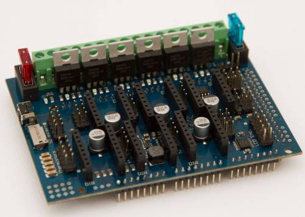

#### Duet
The Duet 2 (Wifi or Ethernet)- are control boards for 3D printers and other similar robots. These control boards are based on a 32-bit ARM processor, running RepRapFirmware. The Duet family can all be controlled through a web interface, but they also support a touchscreen called the PanelDue. They all have a connector for an expansion board containing additional stepper drivers and I/O circuitry - the Duex 2 and Duex 5 for the Duet 2 (WiFi and Ethernet)

Major features include:

 * Powerful 32 Bit Processor: Atmel SAM4E8E: 120MHz ARM Cortex-M4 microcontroller with floating point unit, 512Kb flash memory, 128Kb RAM and many peripherals.
 * Dedicated Wifi module: Low level networking is handled by a separate module, this leaves the main processor free to do precise stepper pulse timing and implement other advanced features.
 * Super quiet TMC2660 stepper drivers: SPI controlled and capable of up to 256 microstepping with optional 16x interpolation when using 16x microstepping. Hardware support for variable microstepping and variable stepper current for optimum speed and power efficiency.
 * On board High speed SD card and support for a second SD external card if required.
 * Dual extruders: 3 heater/thermistor channels for a heated bed and 2 extruders.
 * 3 PWM controllable and 2 always-on fans. These can be run from either the input voltage, from 5V, or from external power for added flexibility.
 * High Power rating: Each stepper driver is capable of 2.8A motor current, currently limited in software to 2.4A. The bed heater channel is specifically designed for high current (18A1)
 * Fuses fitted for bed heater, steppers & other heaters, and fans (v1.04 onwards)
 * The Duet 2 Ethernet is identical to the Duet 2 WiFi except that the WiFi module is replaced by an Ethernet module.

For more information see the Duet3D wiki - https://duet3d.dozuki.com/

#### RAMPS

See https://reprap.org/wiki/Arduino_Mega_Pololu_Shield

#### Radds

A nice, sadly not 100% Open, controller board with optional extension board that can controll 6 (with extension board up to 9) independent stepper motors.
Usually running ontop of a Arduino Due 32bit Board, so it has plenty of performance to controll all Railcore Aspects.
as an alternative to Arduino Due + Raspberry Pi, it could also be mounted ontop of the not so known Udoo Dual / Udoo Quad boards that have an Arduino Due compatible Chip and pinout combined with a ARM Dual/Quad core on a single board.

The Radds can run on 12 or 24 Volts and is quite Flexible in terms of conectivity.

Pros:
  * 32Bit Arduino for Performance
  * Free choice of stepper drivers
  * 12V / 24V support, also mixing of 12V and 24V devices is supported
  * Single Package when used with udoo (less wire mess)
  * precise automotive circuit breakers

Cons:
  * Not fully open source - missing PCB layouts for example
  * not "cheap" - about 80$ without stepper drivers and arduino